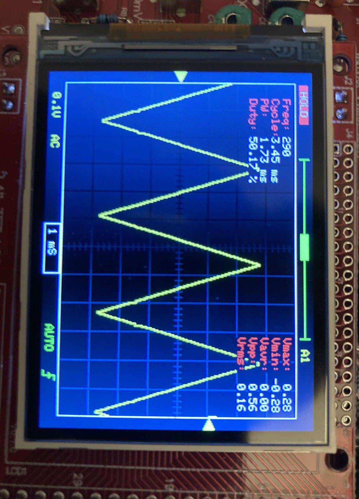
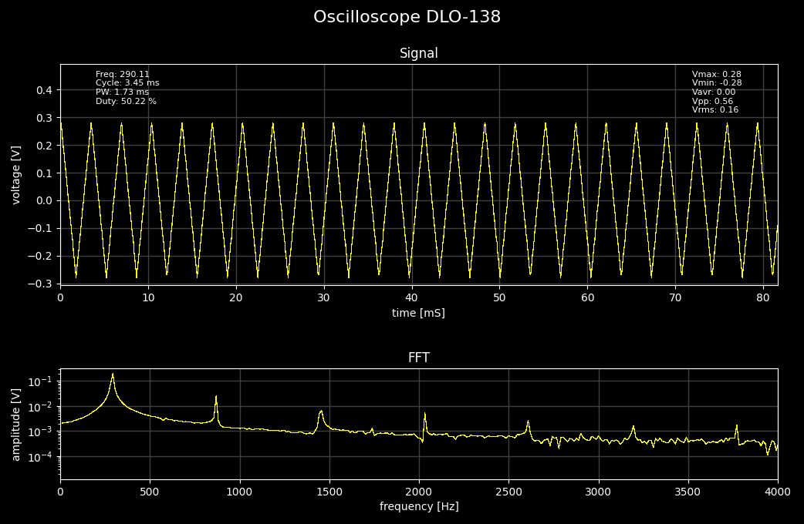

# DLO-138_plotter
A simple tool to parse and visualize the serial output of the DSO-138 oscilloscope with [DLO-138](https://github.com/ardyesp/DLO-138) firmware. The tool plots the signal on the oscilloscope after it was send through the serial port (via USB-TTL converter) and its Fast Fourier Transform (FFT), providing an important tool for the cheap oscilloscope DSO-138 and enabling deeper insights into the signal characteristics.

This repository is based on [DLO-138_plotter](https://github.com/HummusPrince/DLO-138_plotter) by the HummusPrince, and is published because me and some other users (see [here](https://github.com/ardyesp/DLO-138/issues/23)) were unable to run the original DLO-138_plotter on the Linux. This tool fixes this issue by better serial input reading.

## Prerequisites, Installation

Requirements for the tool to run are:.
 - DSO-138 (or DLO-138 modification)
 - USB-to-USB converter
 - [pyserial](https://pyserial.readthedocs.io/en/latest/index.html), [numpy](https://numpy.org/install/), [scipy](https://scipy.org/install/), [matplotlib](https://matplotlib.org/stable/install/index.html)


The installation:
```
git clone https://github.com/J77M/DLO-138_plotter.git
cd DLO-138_plotter
pip install -r requirements.txt
```

## Usage
Run the script using the command line:
```
python3 oscilloscope.py <PORT> [OPTIONS]
```
### Arguments

 - **PORT**: Specify the serial port connected to the DSO-138 (e.g., COM5 for Windows or /dev/ttyUSB0 for Linux).

### Options

- **--fft**: Enables FFT computation and displays the frequency spectrum.

- **--no_stats**: Disables display of voltage and signal statistics on the plots.

- **--xmax VALUE**: Sets the maximum frequency for the FFT plot (default: 4000 Hz).

## Example
```
python3 oscilloscope.py /dev/ttyUSB0 --fft --xmax 2000
```
The text output of the tool after receiving data:
```
waiting for data
receiving data
data received
------------------------------------------------------------
Settings: AC coupling, 	resolution: 50mV/div, 	units: mV, mS
Vmax:		 104.75 mV
Vmin:		 -65.60 mV
Vavr:		 3.56 mV
Vpp:		 170.35 mV
Vrms:		 42.78 mV
Freq:		 195.38 Hz
Cycle:		 5.12 ms
PW:		     2.57 ms
Duty:		 50.16 %
------------------------------------------------------------
```

 For example for a triangle signal shown on the oscilloscope ...



... we get a nice figure with zoom and saving available, same as with [DLO-138_plotter](https://github.com/HummusPrince/DLO-138_plotter). In addition we get a Furier transform of the recorded data, which is very useful in many applications (like building audio related circuits, e.g. synths).




### Testing
The tool was tested with the original DSO-138 without any hardware modifications, running [DLO-138](https://github.com/ardyesp/DLO-138) firmware. The tool is designed to parse and plot data only from analog channel 1, but it should be easily modified to work with all of the channels. 

Works both on Windows (10) and on Ubunut (24.04.1 LTS).


### Author

>Developed by JM on December 13, 2024.
>
>Forked from: [DLO-138_plotter](https://github.com/HummusPrince/DLO-138_plotter) by HummusPrince (plotting and the serial data parsing functions reused)